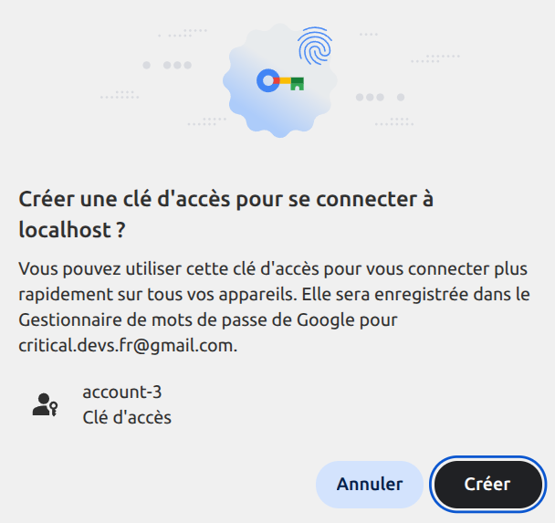
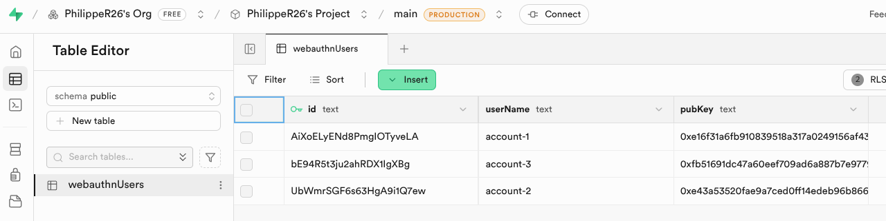
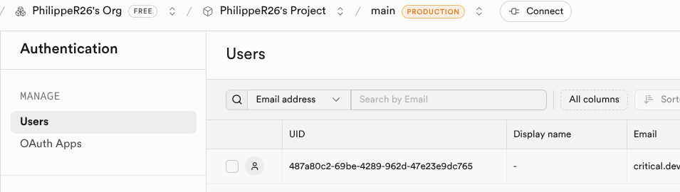
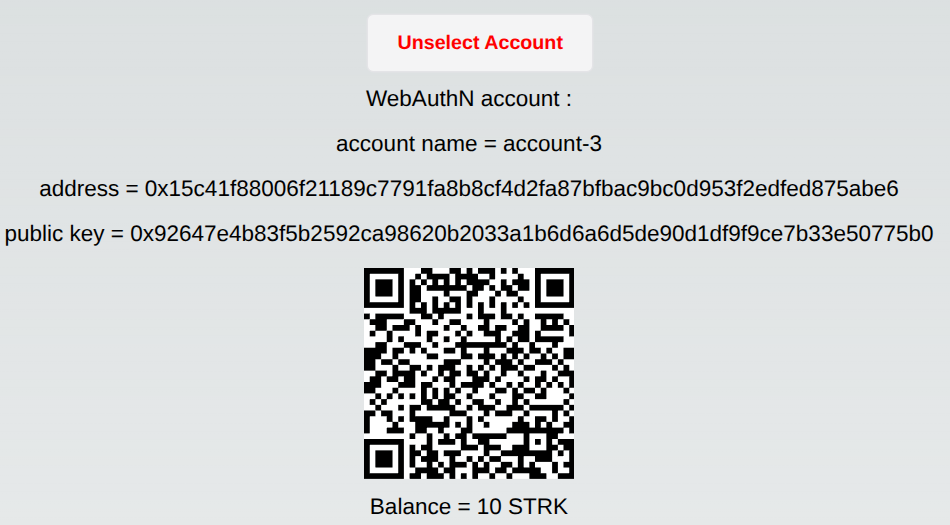
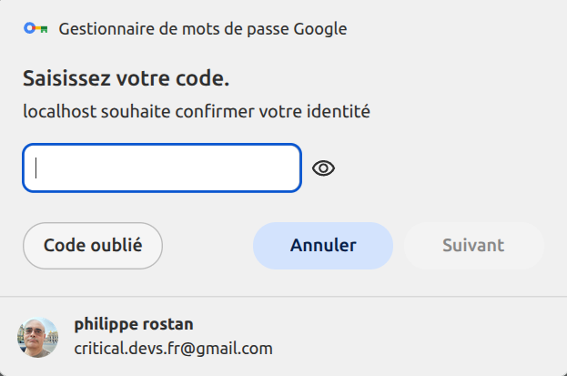
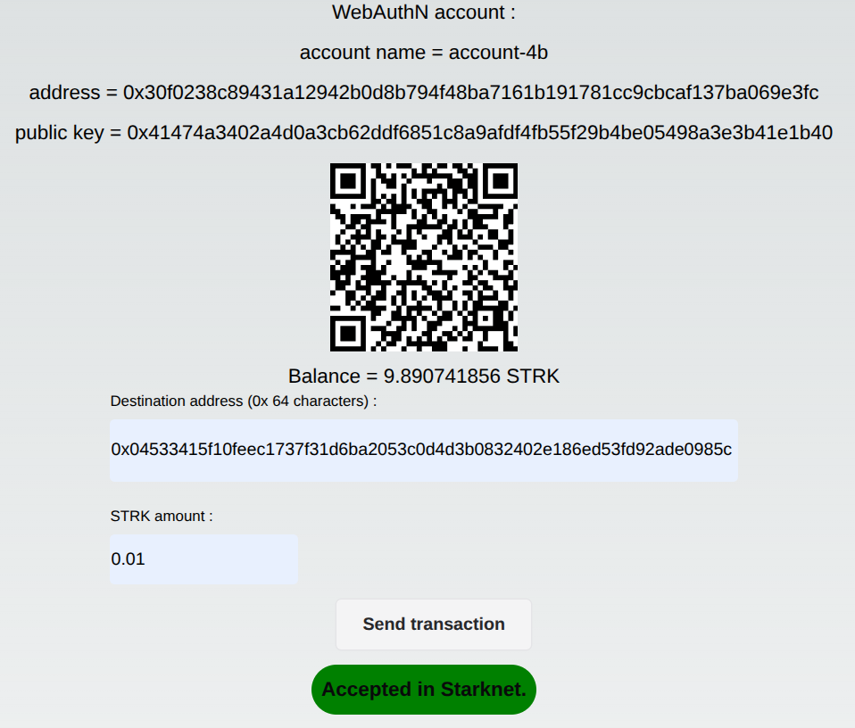

# Starknet-WebAuthN

> [!IMPORTANT]
> - Github stars are appreciated!
> - A version that works with Starknet-Devnet and Chrome Desktop , with a local backend, is available [here](https://github.com/PhilippeR26/starknet-webAuthN/tree/devnet0.6.1).
> - The DAPP is deployed [here]()

## Presentation

This small demo DAPP demonstrates how to develop a Starknet account without any needs of a passphrase or a specific password.  
It's using the Google Password Manager, in conjunction with a Starknet account that uses a webAuthN signature.
By this way, you can create an account and validate your transactions with
- your fingerprint
- or your faceId 
- or your Google account password  
and nothing more needed.

Analyze the code to see how to create a such DAPP (start [here](https://github.com/PhilippeR26/starknet-webAuthN/blob/main/src/app/page.tsx))  

The DAPP is made in the Next.js framework. Coded in Typescript. Using React, Zustand context & Chaka-ui components. The account contract used is the Ready v0.5.0 contract.

## Getting Started 🚀

- Run the development server: 
```bash
npm i
npm run dev
```

Open [http://localhost:3000](http://localhost:3000) with your browser (Linux/Windows Chrome) to see the result.

|     Browser     | Creation of account | Selection of account | Transaction |
| :-------------: | :-----------------: | :------------------: | :---------: |
|     Chrome      |          ✅          |          ✅           |      ✅      |
|      Brave      |          ❌          |          ✅           |      ❌      |
| FireFox, Safari |          ❌          |          ❌           |      ❌      |
|   Edge, Opera   |          ❌          |          ✅           |      ❌      |

> [!NOTE]
> Works with these hardwares: Windows, Linux, Android

> [!WARNING]
> This DAPP is not working in Iphone/Chrome.  
> If somebody knows why it fail, I am interested...

## Usage

Google Password Manager is using WebAuthN signature. A DAPP usage of Google Password Manager needs several steps:
1. The DAPP asks a new account name, that will request a fingerprint/faceID/Password validation to be stored in Password Manager. 
2. Some useful data of the response are stored in a DAPP backend database.
3. An account address is defined with the Password Manager response.
4. A sponsor is deploying the account in Starknet.
5. When a transaction has to be processed, the DAPP ask a signature to the Password Manager.

### 1. Create account name
Define an account name, then click on `Create account` :


Click on create (here in French):



### 2. Store answer in the backend
The answer is an object, containing some data that needs to be stored for long term in the DAPP server. In this DAPP, it's stored in a Supabase database by the backend.  
The stored data :
```json
{
    "id": "aWtbH8LVw7-sTCObZhYBZQ",
    "userName": "account-3",
    "pubKey": "0x92647e4b83f5b2592ca98620b2033a1b6d6a6d5de90d1df9f9ce7b33e50775b0"
}
```
The database definition :


A user has been created, to be able to write in the database:


2 policies have been defined:


### 3. Definition of the account address
We have now all the necessary inputs to calculate the account address.  
First, we have to define the constructor of the account contract. In opposition  to a standard Starknet account, the construction needs not only the public key, but also some additional data :
```ts
Webauthn: {
    origin: readyWebAuthUser.origin,
    rp_id_hash: readyWebAuthUser.rp_id_hash,
    pubkey: readyWebAuthUser.pubKey
}
```
We are using here a Ready v0.5.0 account, that is able to handle WebAuthN signatures.  

> [!NOTE]
> Guardian feature of Ready is not available with this particular type of signature.

The account address is then defined, with the standard Starknet calculation.

### 4. Deployment of the account contract in Starknet Sepolia testnet
The account is deployed by an existing account, that is sponsoring the deployment and an initial funding (1.5 STRK).  


### 5. Send a WebAuthN transaction
Using the result of a request to the Password Manager and the data in the database, a WebAuthNUser object is created
```ts
const webAuthnUser: WebAuthNUser = {
    userName: userName,
    originText: origin,
    origin: CallData.compile(origin.split("").map(shortString.encodeShortString)),
    rpId,
    rp_id_hash: encode.addHexPrefix(encode.buf2hex(sha256(new TextEncoder().encode(rpId)))),
    credentialId: new Uint8Array(credentialRawId),
    credentialIdText,
    pubKey: pubKey,
};
```

A specific Signer is created:
```ts
const webAuthnSigner = new WebAuthnSigner(webAuthnUser);
```
On DAPP side, it's now very easy ; you have to create a Starknet.js  `Account` instance, using this signer:
```ts
const webAuthnAccount = new Account({ provider: devnetProvider, address: address, signer: webAuthnSigner });
```
You can now use all the power of the Starknet.js `Account` class, to proceed easily transactions. 
> [!IMPORTANT] 
> You can estimate fees, but you have to take care that the verification of the signature in the account contract is significantly more expensive than a standard Starknet signature.
> ```ts
> const SignatureValidationCost = 7n * 10n ** 7n; // fri
> const estimateFees = await webAuthNAccount.estimateInvokeFee(transferCall, { skipValidate: true });
> estimateFees.resourceBounds.l2_gas.max_amount += SignatureValidationCost;
> ```
Then you can proceed normally the transaction:
```ts
const resp = await webAuthNAccount.execute(transferCall, {
    resourceBounds: estimateFees.resourceBounds,
    skipValidate: true,
});
```
The Password Manager is asking to approve the transaction:



Then the transaction is processed in Starknet-Devnet:




## Deploy on Vercel 🎊

The easiest way to deploy your Next.js app is to use the [Vercel Platform](https://vercel.com/new?utm_medium=default-template&filter=next.js&utm_source=create-next-app&utm_campaign=create-next-app-readme) from the creators of Next.js.

Check out the [Next.js deployment documentation](https://nextjs.org/docs/deployment) for more details.

> You can test this DAPP ; it's already deployed at [https://cairo1-js.vercel.app/](https://cairo1-js.vercel.app/).

If you fork this repo, you need a Vercel account. You can configure your own environment variables for the Server side :  

